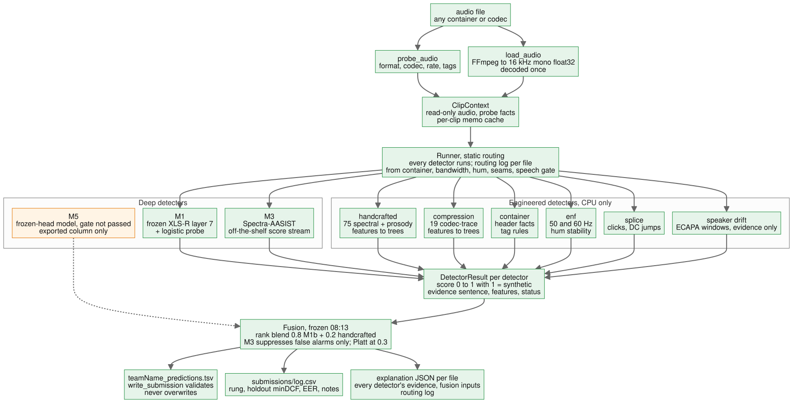

# HEARSAY

HEARSAY is our entry to the NSA HEARSAY challenge at HackGT 13 (Sep 25–27, 2026). You give it an audio file in any format. It returns the probability that the voice is synthetic (0.0 real, 1.0 synthetic) and a per-file report that says which detectors ran, what each one found, and how the final number was put together.

It is a software pipeline and nothing else: one decode path, ten detectors behind one contract, and a fusion rule chosen by a selection rule we wrote down before looking at any result. The deliverable is `CrossExam_predictions.tsv` and this README. An offline Docker image that reproduces the pipeline is kept as reproducibility evidence; NSA said on Saturday it is not required.

**Where to look next:** [docs/STATUS.md](docs/STATUS.md) for the live state, [docs/architecture.md](docs/architecture.md) for diagrams of every component, [docs/code-map.md](docs/code-map.md) for where the code lives, and [docs/reports/](docs/reports/) for the experiment write-ups every number below comes from.

---

## How it decides



_Source: [docs/img/architecture-flow.mmd](docs/img/architecture-flow.mmd)._

1. **Decode once.** Every file goes through one FFmpeg path to 16 kHz mono float32, and the header facts are read before decoding. Nothing downstream ever sees the original container, sample rate or filename.
2. **Run every detector.** Each detector gets the same read-only clip and returns a `DetectorResult`: a score in [0, 1] (higher = more synthetic), a one-sentence reason, named features and a status. A detector that crashes becomes `status="error"` at 0.5 and is treated as missing. It is never treated as evidence and never costs us a row.
3. **Route by role.** Detectors don't all do the same job. Four are **fused**: the XLS-R probe (M1b), the trained head on XLS-R (M5), the handcrafted spectral/prosody model and Spectra-AASIST (M3). The speech gate is a **gate**. Container facts are for **routing**. Compression, ENF, splice and speaker drift are **evidence**: they are printed in the report and never added to the score. Every file's routing log records these decisions in plain English.
4. **Fuse by rank, and let Spectra only pull scores down.** The shipped rule is `0.6 × rank(M1b) + 0.2 × rank(handcrafted) + 0.2 × rank(M5)`, with each rank taken against that detector's own out-of-fold training scores. Spectra-AASIST can only halve a high score, when it is confident the voice is real. It can never raise one.
5. **Abstain at the bottom.** A file with no speech to judge, or one that fails to decode, is pinned below every scored file. With a false alarm costing 9.33 misses, "we don't know" belongs at the real end of the ranking.
6. **Write the TSV and one JSON per file.** The TSV has header `filename<TAB>cm-score`, rows in the template's order, and scores in [0.001, 1] for every file we could judge.

**One file, end to end.** Test file `HGT1046947.wav` is one where the deep detectors disagree. This is the shipped pipeline's own output (`scripts/run_pipeline.py --fusion models/fusion_v2/constants.json`, run live from audio); its score matches the submitted TSV `submissions/20260926-0914_M4_sweep_A3_w0.2_E_CANDIDATE_our_direction.tsv` to 7e-6:

```text
fused    m1b_v3          XLS-R layer-7 probe: calibrated log-likelihood ratio -5.78 (real-like, P=0.00)
fused    m5_xlsr_ft      XLS-R fine-tuned head (M5, 12 layers, attentive pooling): logit +5.64 (synthetic-like, P=1.00)
fused    handcrafted     real-like (P=0.16): LFCC 16 frame-to-frame change 3.0 SD below real speech (toward synthetic); ...
fused    spectra_aasist  spoof-minus-bonafide margin +9.50 (synthetic-like, P=1.00)
evidence speaker_drift   voice drifts across the clip: minimum window-to-window speaker similarity -0.10 over 14 windows
evidence compression     compression-trace features synthetic-like (P=0.91): ...
routing  container       wav/pcm_s16le 16000 Hz mono, [encoder=Lavf58.29.100]: no class evidence in the container
gate     speech_gate     speech present: voiced 28% of frames, pitch spread 0.34, loudness std 18.5 dB

routing_log:
  container: PCM WAV, not lossy, FFmpeg-written; compression forensics run for evidence, not score
  compression: effective bandwidth 7500 Hz, above the 7.25 kHz band match
  enf: no mains hum; no environment evidence either way
  splice: no editing seams
  speaker_drift: voice drifts (min window similarity -0.10); evidence only, never fused
  speech_gate: is_speech=true (voiced 28% of frames); default-answer policy not applied
  fusion: e_on_a (A3_w0.2_E): 0.6 x rank(m1b_v3) + 0.2 x rank(handcrafted_v5) + 0.2 x rank(m5_xlsr_ft) = 0.319;
          M3 margin +9.50, no suppression (M3 never promotes)

probability_synthetic = 0.0348  -> real
```

(`e_on_a` in the fusion line is the runner's name for the rule family; `A3_w0.2_E` is the rule the constants file defines.)

Spectra-AASIST and M5 both say this voice is fake; the probe and the handcrafted model say real. Under the equal-weight rule we first tried (zmean, 06:02), Spectra's vote carried the file to 0.686, above the midpoint. Under the shipped rule M5's 20% share lifts it from 0.0027 (the previous rule, without M5) to 0.0348, which is still firmly real. Spectra gets no say in that direction: we don't let a pretrained model with undisclosed training data push a file toward "synthetic", because being wrong that way is the expensive error. The drift and compression lines stay in the report as evidence and never touch the score.

Seven more real test files, each with its full routing log, every detector's evidence sentence, the shipped and the rejected equal-weight probability, and a paragraph on why the system said what it said, are in `docs/reports/2026-09-26_worked-examples.md`: a confident real, a confident fake, the file where Spectra's suppression fired, a fake with a stable mains hum, a real file with editing seams, a 21%-voiced file near the gate, and a genuinely uncertain file scored 0.471. They were written on the previous rule, `e_on_a`. The report's addendum re-runs all eight live under the shipped rule, and the results agree with the submitted TSV to 5.4e-5. No example changes side of 0.5: the largest moves are the uncertain file (0.471 → 0.466) and `HGT1046947` above (0.0027 → 0.0348). The router-on vs router-off measurement is under [Orchestration](#orchestration-what-routing-changes).

---

## Results at a glance

All figures are normalized minDCF with `C_FA = 4`, `C_miss = 1`, `π_synth = 0.3` (9.33·P_FA + P_miss; lower is better). "Holdout" is our outer holdout of two unseen generators plus 26 unseen real-speech groups. "In-the-Wild" is a public set of web-sourced real and fake speech that we never trained on.

| | Inner OOF | Holdout | In-the-Wild | Source |
|---|---|---|---|---|
| Shipped fusion (`A3 w 0.2 + E`: M1b, handcrafted and M5 by rank, Spectra suppression) | 0.135 | 0.0065 | 0.228 | `docs/reports/2026-09-26_fusion-sweep-predeclared.md`, M5 addendum |
| Previous rule (`E on α 0.2`, no M5), the fallback | 0.140 | 0.014 | 0.260 | same report |
| M1b alone (the best single detector we trained) | 0.301 | 0.072 | 0.343 | same report |
| NSA test set (the number that counts) | | | | _pending: the draft review's returned minDCF_ |

The full per-detector and per-rule tables are in [Numbers](#numbers).

---

## Approach and architecture

### What shaped the design

- **The metric punishes false alarms.** Calling a real file synthetic costs four times a miss, and about 70% of the test files are real. So the real-speech side of every model got the most scrutiny, and every rule was chosen on minDCF, with EER only reported. minDCF depends only on ranking, which is why our fusion works in ranks.
- **The rubric rewards distinct techniques and choosing them per file.** So each technique is its own detector behind one contract, and each file gets a routing log.
- **The training data and the test data were made differently.** We found five ways they differ, all of which a model can exploit as shortcuts (see [What did not work](#what-did-not-work)). Most of our engineering went into closing them.
- **Everything runs offline on CPU.** No hosted API and no LLM on the scoring path. LightGBM is never imported at inference: it and PyTorch each ship their own OpenMP runtime and crash together on macOS, so the trained trees are dumped and evaluated in numpy (`hearsay.trees`).

### The detector contract

`src/hearsay/detectors/base.py`. A detector takes a `ClipContext` (path, decoded audio, probe metadata, a per-clip cache) and returns a `DetectorResult(name, score, evidence, features, status, error)`. The contract rejects a score outside [0, 1], a non-finite feature or empty evidence with a `ValueError`; nothing is silently clipped. Detectors never read filenames or file timestamps, because git, zip and Docker rewrite them. `safe_run` wraps every call so one bad file can't cost a TSV row.

Every learned detector exports one file, `outputs/detector_scores/<name>.csv`, with columns `path, fold, split, score, logit` over the same 21,671 rows (20,000 training clips and the 1,671 test files). Fusion reads only these exports, so every detector can be swapped or ablated without touching the others.

### Deep detectors

| | What it is | Role | Why |
|---|---|---|---|
| **M1 / M1b** | Frozen XLS-R 300M; layer-7 hidden state averaged over time, then a class-balanced logistic regression and a Platt map. M1b adds 40 VCTK real speakers from ASVspoof 2019 and a 2.5k spoof anchor to the training folds only. | Primary fused score (60% of the rank blend) | Layer 7 won inner cross-validation (0.257; layers 6 and 8 close; layers 20+ at 0.40–0.43, `models/m1_…_0518/meta.json`). Mid-depth SSL layers carry the acoustic detail that separates vocoders; the top layers are tuned for phonetic content. |
| **M3, Spectra-AASIST** | `lab260/Spectra-AASIST` run off the shelf with no training, through the same band-matched input path and crops. Short clips are zero-padded to one 4.04 s window. | False-alarm suppressor only | It is the strongest detector on every set we hold, but its model card names no training set, so none of our validation rows can be shown to be out-of-sample for it. It is allowed to lower a score and never to raise one. Leakage probes support keeping it in that role (see [What did not work](#what-did-not-work)). |
| **M5, trained head on XLS-R** | 12 kept XLS-R layers, learned layer weights, attentive statistics pooling, linear head; trained on rented A100s with class-blind augmentation (noise, telephony band-limits, reverb, codecs, RawBoost). | Fused (20% of the rank blend), since the 12:03 switch | It did not clear its gate as a replacement for M1 (holdout 0.363 vs 0.159), but it is wrong on different files. As a third rank input it passed the second pre-declared sweep (below). The runner loads it only when the constants file gives it a weight, and refuses a checkpoint whose hashes don't match the file. |

### The eight forensic techniques

| Rubric technique | Detector | How it's used | What it measures |
|---|---|---|---|
| Metadata / container | `container` | routing | Header facts (codec, rate, bit depth, encoder tag). Rule-based on purpose: on our data the container *is* the label (below). |
| Spectral | `handcrafted` | fused (20%) | 234 features: spectral contrast, flatness, flux, roll-off, MFCC, LFCC and CQCC statistics, group-delay and phase-coherence cues; LightGBM. |
| Prosody | `handcrafted` | fused | YIN pitch spread and slope, jitter/shimmer, loudness modulation, pauses, breath frames. Pitch variability is the one prosody cue that carried signal. |
| Compression | `compression` | evidence | 19 codec-trace features in 3–7 kHz (spectral holes, floor depth, effective bandwidth), trained with both classes laundered through MP3/AAC. |
| ENF | `enf` | evidence | Tracks 50/60 Hz mains hum and its stability on 2 s windows. |
| Speaker-embedding consistency | `speaker_drift` | evidence | ECAPA-TDNN embeddings on 1 s windows; flags a voice that changes within the clip. |
| Deep anti-spoofing | M1b, M5, M3 | fused (M3 as suppressor only) | Above. |
| Splice | `splice` | evidence | Sample-level clicks and DC-offset jumps between 100 ms windows. |

Plus the **speech gate** (`speech_gate`), which decides whether a file contains speech at all from five cues: not silent, at least 5% voiced, pitch moving, loudness moving, not spectrally flat. We set each threshold beyond the extreme value in the full test set, so it gates 0 of 1,671 test files and only catches silence, tones, static and noise.

### Orchestration: what routing changes

Orchestration here is a set of fixed rules over measured file properties, not a learned router. Every detector runs on every file: the whole test set is about 95 minutes of audio, so compute was never the constraint. What the rules decide is what each result is *allowed to do* to the score. The per-file routing log records each decision.

- **Container → compression.** The container detector reads the header first, and its facts set how compression forensics is reported. A lossy header gets "compression forensics apply"; a PCM file written by FFmpeg (every test file) gets "run for evidence, not score". Either way compression describes the file's pipeline, not the voice, and never enters the score.
- **Bandwidth.** Compression reports each file's effective bandwidth against our 7.25 kHz band match. That flags the few test files that don't share the test set's 7.2 kHz low-pass (981 read 7,250 Hz, 670 read 7,500 Hz, 12 read full band and 8 sit at 5–7 kHz, `docs/reports/2026-09-26_cpu-detectors.md`).
- **Speech gate → abstention.** A file that fails the gate skips fusion and goes into the pinned block (below).
- **Spectra → suppression only.** If Spectra's margin is below −3 (strongly real) and the fused rank is above 0.5, the rank is halved. If Spectra is missing, nothing is suppressed.
- **Imputation.** If a fused detector errors on a file, its column is imputed at its training mean, and the log names it.

**The abstention path.** Undecidable files (non-speech, decode failures) get scores in [0, 0.001). Every scored file gets a score in [0.001, 1], so the block sits strictly below all of them. Inside the block, files are ordered by the weak M1b signal plus a hash of the filename, so no two share a value; decode failures go to the very bottom. Placing the block at the bottom is the right call under *both* possible readings of the sponsor's scorer. It is optimal under the brief's cost when the block's fake rate is below 80%, and under the scoring code's inverted cost when it is above 9.7%. Undecidable files should sit near the 30% base rate, which leaves roughly a 3× margin on each side (`docs/consults/2026-09-26_fusion-strategy_RESPONSE.md`, item 5). No test file is gated today, so this costs nothing on the current ranking. It only protects against a silent or musical file being scored as synthetic, which our deep models do: the first probe scored pure silence at 0.99.

**Router on vs off, measured.** `scripts/orchestration_ablation.py` re-fuses the exported detector scores with each rule switched on and off. It reports minDCF under both cost weightings and the number of files each rule touched (`outputs/fusion/orchestration_ablation_v2.md`, shipped rule; the same table for the previous rule is in `outputs/fusion/orchestration_ablation.md`). The three configurations:
- **Router off** is the plain `0.6 / 0.2 / 0.2` rank blend, with no Spectra suppression, no gate and no pinned block.
- **Fuse everything equally** is a four-way equal rank mean of M1b, the handcrafted model, M5 and Spectra.

| Split | Router on (shipped) | No Spectra suppression | Router off | Fuse everything equally | Files Spectra suppression touched | Files the gate touched |
|---|---|---|---|---|---|---|
| Holdout, 3,858 rows | 0.0065 | 0.0200 | 0.0200 | 0.0045 | 83 (all real) | 31 |
| In-the-Wild, brief cost | 0.229 | 0.274 | 0.274 | 0.214 | 24 (all real) | 9 |
| In-the-Wild, sponsor-code cost | 0.2415 | 0.2535 | 0.2505 | 0.1955 | | |
| NSA test, share above 0.5 | 27.5% | 30.3% | 30.3% | 28.8% | 47 | 0 |

- **Spectra suppression is the rule that changes decisions.** It cuts the holdout cost to a third (0.020 → 0.0065) and takes 0.045 off In-the-Wild under the brief's cost, and every file it touched where a label exists was real. It held under the previous rule too (0.030 → 0.014, 0.322 → 0.258).
- **The gate is a measured null on the test set.** It touched 31 holdout rows (no change in cost), 9 In-the-Wild rows, and 0 test files. On In-the-Wild it cost 0.001 under the brief's cost and 0.003 under the sponsor code's (0.228 without it, the sweep's number). Under the previous rule it gained 0.003 under the brief's cost.
- **The evidence-only detectors never move a score, by design.** They flagged 591, 504 and 180 holdout rows (hum, seams, drift) and 24, 58 and 269 test files.
- **Our rule does not win every readout.** With M5 in the blend, fusing everything equally beats the shipped rule on every labeled readout (holdout 0.0045, In-the-Wild 0.214 and 0.196). It does so by giving Spectra-AASIST a full vote. We ruled that out before seeing these numbers, because Spectra's training data is undisclosed and our validation rows may be in its training set. So the choice rests on that argument, not on these readouts, and we report them as measured.

### The fusion rule

The shipped rule is whatever `final` names in `models/fusion_v2/constants.json`; the record of how it was chosen is `docs/reports/2026-09-26_fusion-sweep-predeclared.md` (the main sweep and its M5 addendum). Today that is `A3_w0.2_E`, ratified by Nathan at 12:03 on Saturday (the `submissions/log.csv` row written when he gave the go). The rule before it, `E_on_A_alpha0.2` in `models/fusion_v1/constants.json`, is the fallback. It got there in two pre-declared steps.

**Step 1, frozen at 08:13.** We wrote the candidates and the selection rule down before running anything (`docs/reports/2026-09-26_fusion-sweep-predeclared.md`), then applied the rule once:

- **Candidates:** a rank blend `(1−α)·rank(M1b) + α·rank(handcrafted)` for α from 0 to 0.5; min and max rules; a cascade; a non-negative stacker shrunk toward equal weights. Then, on top of the winner, Spectra as a false-alarm suppressor.
- **Rule:** keep candidates within 0.03 of the best inner out-of-fold score whose In-the-Wild minDCF under the sponsor code's cost is ≤ 0.45. Among those, take the best In-the-Wild minDCF under the brief's cost, with ties going to more M1b. Add Spectra suppression only if it helps In-the-Wild by ≥ 0.01 without hurting inner or holdout by more than 0.01. No iteration afterward.
- **Result:** α = 0.2 (tied with 0.3; the tie went to more M1b). Adding Spectra suppression moved In-the-Wild from 0.322 to 0.260 and hurt nothing, so it was applied. Final: inner 0.140, holdout 0.014, In-the-Wild 0.260 (0.267 under the sponsor code's cost).

**Why not equal weights.** Our first fusion (05:32) averaged the two detectors equally, as `zmean` (mean of standardized logits) and `rankmean` (mean of ranks). On the holdout it looked like the best thing we had: 0.018 and 0.015, against 0.072 for M1b alone. On In-the-Wild it doubled the misses, from 28% for M1b alone to 58–60%, and pushed the share of test files called synthetic up to 32–40% (`docs/consults/2026-09-26_fusion-strategy_CONSULTATION.md`). The holdout gain (about 0.05) was below the holdout's resolution floor. The In-the-Wild loss was large and consistent. The handcrafted column is excellent on generators it has seen and blind to the web-sourced fakes (97% missed on its own), so giving it half the vote traded real-world detection for a holdout number. We dropped equal weights and let the sweep choose α.

**Step 2, the M5 addendum, shipped at 12:03.** At 08:35 we wrote down two M5 candidates and a stricter replacement rule before running them: replace the frozen rule only if In-the-Wild improves by ≥ 0.01 under the brief's cost, gets no more than 0.01 worse under the sponsor code's, the holdout gets no more than 0.05 worse, and inner no more than 0.03 worse. The candidates were M5 as a second false-alarm suppressor (F) and M5 as a third rank input (A3).
- F missed the bar: its In-the-Wild gain was 0.003.
- A3 at weight 0.2, plus the same Spectra step, qualified: `0.6·rank(M1b) + 0.2·rank(handcrafted) + 0.2·rank(M5)`. Inner 0.135 vs 0.140, holdout 0.0065 vs 0.014, In-the-Wild 0.228 / 0.239 (brief / sponsor-code cost) vs 0.260 / 0.267.
- We had predicted A3 would lose on short clips and LibriSpeech real speech. With the Spectra step it improved both.
- On the test set the switch changes little: Spearman 0.974 against the previous rule's scores, and 3 of 1,671 files cross 0.5.

Nathan first held it (09:25) because the previous rule was the file planned for the draft review. The runner side was built behind a flag (`8316e50`), and at 12:03 he ratified the switch. The submitted file is `submissions/20260926-0914_M4_sweep_A3_w0.2_E_CANDIDATE_our_direction.tsv`, sent as `CrossExam_predictions.tsv`.

**Score direction.** The instructions say 1.0 = synthetic. NSA's scoring code (ASVspoof5's) treats a higher score as bona fide. We follow the instructions and never flip. Every model logs its minDCF under the sponsor's code both ways, and a pre-flipped twin of the draft TSV exists in case NSA's feedback shows they grade inverted.

---

## Validation

- **Folds by generator and speaker, never by clip.** `splits/nsa_folds.csv` (20,000 rows: 10 DiffSSD generators, LJ Speech, LibriSpeech). Fakes are grouped by generator; real speech by speaker (LJ, a single speaker, by chapter). Five inner folds each hold out whole generators: grad_tts + unit_speech, diffgan_tts + openvoicev2, pro_diff + xtts_v2, your_tts, ElevenLabs. Every learned piece of a detector, scalers and Platt maps included, is fit fold-locally, and selection uses only inner out-of-fold scores.
- **One outer holdout, read once per model.** PlayHT and WaveGrad2 plus 26 real-speech groups (3,858 rows). Nothing was ever trained, tuned or selected on it. Extra training data (ASVspoof 2019 real speakers, MLAAD, the rest of DiffSSD) enters inner folds only, so holdout numbers stay comparable across every model.
- **The holdout has a resolution floor.** With two held-out generators its noise is about ±0.07–0.10, so we treat any gap under 0.15 as noise. It can tell a good detector from a bad one, not a good fusion rule from a slightly better one.
- **In-the-Wild is the stress test.** 3,000 clips (2,000 real from 54 speakers, 1,000 fake), evaluation only, never trained on. For each model we report minDCF and the false-alarm rate at the threshold chosen on inner folds. From the fusion sweep on we report it under both cost weightings: the brief's, and the sponsor code's, where the 4× lands on a missed fake.
- **The test set as a smoke alarm.** We track the share of test files scored above 0.5 against the ~30% the brief states. It flagged the band mismatch (below). It is never a selection signal: any monotone rescaling changes it without changing minDCF.
- **The draft review.** NSA scores one early submission for us and returns minDCF only. We sent the exact artifact we ship and decided in advance what each returned number means:

| Returned minDCF | What it means | What we do |
|---|---|---|
| 0.00–0.20 | our direction; the test set behaves like our holdout | ship unchanged |
| 0.20–0.45 | our direction; the test set is more like In-the-Wild | switch to the most false-alarm-robust candidate |
| 0.45–0.90 | ambiguous | don't flip; fall back to M1b alone |
| 0.95–1.00 | NSA's code reads our scores inverted | ship the pre-flipped twin |

**Sent** Saturday 12:30 by Discord DM (team Cross Exam): `CrossExam_predictions.tsv`, a copy of `submissions/20260926-0914_M4_sweep_A3_w0.2_E_CANDIDATE_our_direction.tsv` (sha256 `fb783076…`, `submissions/log.csv` row 12:30:37). _Pending: the returned minDCF and the action taken (`docs/reports/2026-09-26_sponsor-questions.md`)._

---

## What worked

Each line names what we did, what it did, and why.

- **Band-matching the training audio to the test set.** The test set is low-passed at about 7.2 kHz and no training corpus is. A 71-tap Kaiser low-pass at 7.25 kHz on every clip, train and test, took the handcrafted detector from calling 90% of test files synthetic to 42%. Without it, everything above 7 kHz was a train-vs-test fingerprint (`docs/reports/2026-09-26_cpu-detectors.md`).
- **Real-speaker diversity, once band-matched.** Adding 40 VCTK speakers (M1b) improved the holdout from 0.159 to 0.072 and In-the-Wild from 0.380 to 0.342. Before band matching, the same addition made In-the-Wild *worse* (0.374 → 0.405): the wall was hiding the gain (`submissions/log.csv`, `docs/reports/2026-09-26_m1b-asv19-bonafide.md`).
- **Length parity.** Test clips are about 3.4 s and training clips 5–9 s. Embedding each clip at its own length and training on crops drawn from the test-length distribution removed a repeat-padding seam that only test clips had; it was worth 0.05 on its own for the handcrafted detector (0.709 → 0.661).
- **Gradient-boosted trees over logistic regression** for the handcrafted features: holdout 0.374 vs 0.661 on the same features. The trees transfer to unseen generators and the linear model does not (`docs/reports/2026-09-26_cpu-detectors.md`).
- **New feature families that see new generators.** CQCC frame-to-frame change and LFCC upper-coefficient variability made pro_diff visible (1.00 → 0.32 out of fold) and cut inner minDCF from 0.614 to 0.434 (`docs/reports/2026-09-26_handcrafted-v4.md`).
- **Augmented twins for the handcrafted model.** Codec round-trips and random spectral tilt, added as fit-only extra rows, cut holdout-real false alarms from 9.1% to 6.3% and In-the-Wild false alarms from 0.65% to 0.40%, and improved the holdout (0.170 → 0.137). The price was inner minDCF (0.418 → 0.469) and pro_diff (0.30 → 0.63). With a false alarm worth 9.33 misses, we took the trade (v5b).
- **Treating the container as routing, not evidence.** We measured it before using it and found it was the label (see [What did not work](#what-did-not-work)), so the detector never learns from it.
- **Laundering both classes for compression forensics.** Re-encoding a random half of *both* classes through MP3/AAC meant the detector could not learn "MP3 = ElevenLabs/PlayHT". It then detects codec history well (AUC 0.90–0.94).
- **A pre-declared fusion sweep.** Writing the candidates and the selection rule down first stopped us from shipping the equal-weight rule our holdout liked best.
- **M5 as a minority vote.** Alone it lost to the plain probe on every holdout readout. Given 20% of the rank blend beside M1b and the handcrafted model, it cut the fused holdout from 0.014 to 0.0065 and In-the-Wild from 0.260 to 0.228. It errs on different files than M1b, and that is what fusion uses.
- **Spectra-AASIST as a one-way vote.** As a false-alarm suppressor it moved In-the-Wild from 0.322 to 0.260 without raising the inner or holdout cost. Used that way, if it is wrong about a file the cost is a miss (weight 1), never a false alarm. The later leakage probes found the step fires on 4–5% of holdout real clips and on no holdout fake under any perturbation we tried. It does damp 1.2% of unseen MLAAD fakes (7 of 572), each of which becomes a miss, and it never raised the fused minDCF (`docs/reports/2026-09-26_channel-robustness.md`).
- **The phase cues as evidence.** Peak phase-vs-magnitude coherence separates grad_tts from real speech (AUC 0.80), is corpus-neutral, and names a vocoder property a person can check.

## What did not work

Each null result, with its mechanism.

- **Five shortcuts in the data, all found and closed.**
  - **Level:** test clips peak near full scale and training real speech near 0.5; peak alone predicted the label (AUC 0.66). Closed by normalizing each input.
  - **Leading silence:** LibriSpeech starts with about 0.37 s of silence, test clips 0.06 s. Closed by trimming both.
  - **Tiling:** repeat-padding short test clips put a seam only in test data. Closed by length parity.
  - **Container:** every test file is 16 kHz PCM WAV with the same FFmpeg tag. Closed by one decode path.
  - **The 7.2 kHz wall:** closed by band matching. We later checked whether the wall is a codec, so we could reproduce it more faithfully in training. It isn't: across 34 MP3 and AAC settings none matched it better than our own Kaiser low-pass (the closest was 3% nearer on distance and worse on spectral holes). It is a smooth low-pass, like a resampler's anti-alias filter, so the planned symmetric codec refit never ran.
- **The container is the label.** LibriSpeech is FLAC, LJ is 22 kHz WAV, and DiffSSD's ElevenLabs and PlayHT are MP3. PlayHT's MP3s carry the exact encoder tag (`Lavf58.29.100`) that all 1,671 test files carry. A learned metadata model would score perfectly on our holdout (PlayHT) for the wrong reason, then call the whole test set PlayHT. The container detector returns a constant 0.5 on this test set by design.
- **Compression forensics sees the pipeline, not the class.** With codec history equalized, class holdout minDCF is 0.90 (`models/cmp_selected/meta.json`), and it calls 81% of the test set synthetic, because the test set reads as laundered throughout (mean P(laundered) 0.62). It stays as evidence.
- **ENF can't be validated here.** Stable mains hum is in 36% of LJ Speech clips (a home studio) and 21% of LibriSpeech, and in almost no generated audio, so a learned version would learn "hum = LJ = real". Only 24 test files carry hum. Rule-based and mild on purpose; evidence only.
- **Splice finds vocoder artifacts, not edits.** On training data the seams are single-sample clicks in 27% of WaveGrad2 and DC jumps in 9–13% of several generators *and* 9% of LibriSpeech. The sponsor said no test clip is partially synthetic. It flags 58 test files; evidence only.
- **Speaker drift points the wrong way.** Fakes are the *most* self-consistent voices: mean window-to-window similarity separates them toward fake at AUC 0.73. A cloned voice doesn't vary from second to second the way a person does. Drift flags 16% of test files, mostly the hard real recordings. Fused, it would push those toward synthetic, so it is evidence only (`docs/reports/2026-09-26_gate-and-drift.md`).
- **Fine-tuning XLS-R lost to a frozen probe.** Fine-tuning all 12 kept layers fit the seen generators (training loss at the label-smoothing floor) and transferred worse to the unseen commercial one: 0.38–0.41 on the ElevenLabs fold vs 0.31 with the backbone frozen. The frozen-backbone head then lost to the plain M1 probe on the holdout (0.363 vs 0.159), on WaveGrad2, on LibriSpeech real speech and on clips under 4 s (0.60). It won only on In-the-Wild false alarms (0.45% vs 0.7%). Its one use is as a 20% voice in fusion (see What worked). Twelve A100 instances (six never booted), $5.42 in total (`docs/reports/2026-09-26_m5-xlsr-finetune.md`).
- **Pruning corpus-cue columns hurt every time.** 83 handcrafted columns separate LJ from LibriSpeech more than they separate real from fake. Dropping them made every readout worse, including LibriSpeech false alarms (0.54 → 0.59–0.61); stripping v3's own cue columns took it from 0.614 to 0.848. The check told us which per-source numbers to read, not which columns to delete.
- **The handcrafted detector's test-domain offset.** Even band-matched, the test recordings have a darker, codec-like spectral envelope. The 234 columns tell train from test at AUC 0.99, and 84% of the shifted columns move toward "fake". Pruning the shifted columns made it worse (the rest still separate at 0.98); augmentation removed only part of it. This is part of why it gets 20% of the vote, not half.
- **grad_tts is invisible to the handcrafted model under our validation.** Its phase cue is shown by no other generator, so when grad_tts is the held-out one, nothing teaches the cue: 1.00 in every variant. That is an honest limit of holding out by generator.
- **Prosody beyond pitch.** Pause fraction and count, voiced fraction, loudness dynamics and zero-crossing rate all sat within 0.05 of chance.
- **Equal-weight fusion.** Best on the holdout, twice the In-the-Wild misses (above).
- **Our holdout overstates real-world skill.** Every XLS-R probe we trained sits at 0.34–0.41 on In-the-Wild against 0.07–0.16 on the holdout, and the handcrafted model gets 1.00 there. Channel robustness, not more read speech or more fake data, is the gap we did not close. We tried to measure how "wild" the test set is. A classifier separating our holdout's real speech from In-the-Wild's real speech, run over the test files, puts the wild share at λ̂ = 0.51 (95% CI 0.12–0.64; 0.36 when the reference clips are cropped to test lengths, 0.48–0.57 across rate-consistent variants). The reading is indeterminate. On 10 of the 21 channel features the test set lies outside the span between our holdout and In-the-Wild, so it is its own recording population rather than a mix of our two validation sets. The shipped rule beats the previous one on both, so the choice doesn't depend on λ.
- **A pretrained model we can't audit, then probed.** Spectra-AASIST separates our inner rows perfectly (AUC 1.000). Its model card reports results on In-the-Wild and names no training set. LJ Speech, LibriSpeech and DiffSSD are all public and plausible training data for it, so its inner, holdout and In-the-Wild numbers may all be in-sample. We could not settle that, so we probed for the symptoms of memorisation instead (`docs/reports/2026-09-26_channel-robustness.md`):
  - **Stability.** On 500 holdout clips under four label-preserving changes (MP3 64 kbps, 20 dB noise, ±2% speed, a one-sample shift), its decisions barely moved: mean |ΔAUC| 0.0008, against 0.0041 for M1b. Its fine rank order moved the most of the three deep models, though (Spearman clean vs noisy 0.875, against 0.913 for M1b and 0.939 for M5). With a clean AUC of 1.000, its ΔAUC had little room to fall anyway.
  - **MLAAD generators.** On 572 MLAAD clips from 143 generators it had the lowest miss rate of the four detectors tested: 14.9%, against 22.7% for M1b, 28.7% for M5 (which trained on MLAAD) and 56% for the handcrafted model. Whether Spectra itself saw MLAAD is unknown.
  - **No harm to the fused score.** Its suppression step never raised the fused holdout minDCF under any perturbation, and it lowered it in 4 of 5.
  - **Verdict:** keep it as a suppressor only, which is how it shipped. The probes show the *suppression step* is safe: it fires on no holdout fake under any perturbation, damps 1.2% of MLAAD fakes (7 of 572), and never raised the fused minDCF. They do not show that Spectra generalises; its strong scores are also consistent with having seen DiffSSD- or MLAAD-like data. Its In-the-Wild score stays untrusted, because its authors evaluated on that set.
- **Peak-normalizing Spectra's input** (a fix for its within-fake level correlation) cost 0.033 on real speech and did not remove the correlation, so the level was a proxy, not the cue. Rejected.
- **Additive noise is the shipped rule's weak spot.** At 20 dB SNR white noise on 500 holdout clips:
  - The handcrafted model loses almost all discrimination: AUC 0.998 → 0.64, minDCF 0.048 → 0.996.
  - M1b rises from 0.056 to 0.271, and the shipped rule from 0.012 to 0.269. Noise turns fakes into misses, not false alarms: at their fixed thresholds M1b misses 88% of fakes and the handcrafted model 99%, with false alarms still at or under 0.4%.
  - Spectra holds at 0.116, but noise pushes it out of its "strongly real" region, so its suppression step never fires and can't help.
  - Found after the rule was frozen and not fixed. The pointer is noise augmentation of the handcrafted training, applied to both classes.
- **A wild, non-read real-speech corpus for the inner folds was planned and not attempted.** It was the fusion consult's suggested fix for the In-the-Wild gap. We dropped it at 12:16 on Saturday, because a download, extraction and refit would not fit the time box, and the time went to the Spectra probes and the λ estimate. The two candidates we had identified looked unusable anyway: VoxCeleb1's test set needs a request form, and SpoofCeleb's real speech has been speech-enhanced, which its authors warn about (`docs/reports/2026-09-26_channel-robustness.md`, `docs/handoffs/2026-09-26_channel-robustness-handoff.md`).
- **Our first estimate of how wild the test set is was wrong.** It said λ̂ = 0.947 with a classifier AUC of 0.99, and read "wild" as "codec-processed". One feature did the work: a whole-spectrogram noise-floor percentile that landed in the 7–8 kHz stopband. It was measuring the test files' double low-pass, not the recording channel: one MP3 round-trip moved 91% of our clean clips to "wild". Dropping that feature, under the rule we had already declared for columns above 7 kHz, gave 0.51 (MP3 control 91% → 9%). It is the same kind of shortcut as the 7.2 kHz wall, a band no training clip has, read through a feature that didn't look like a band feature.

---

## Numbers

Normalized minDCF, `π_synth = 0.3`, `C_FA = 4`, unless marked. **Inner** = pooled out-of-fold over the 16,142 inner rows. **ITW** = In-the-Wild (3,000 clips, never trained on); "averse" is the sponsor code's cost (the 4× on a missed fake). **ITW FA** = In-the-Wild real-speech false-alarm rate at the model's own inner-fold threshold. **Test > 0.5** = share of the 1,671 test files above 0.5 (brief: ~30% synthetic); a sanity check, not a score. Every cell comes from the file in its row's last column; "—" means that file does not report it.

### Detectors

| Detector | Inner | Holdout | Holdout EER | ITW | ITW FA | Test > 0.5 | Source |
|---|---|---|---|---|---|---|---|
| M0 constant "always real" | — | 1.000 | 50% | — | — | 0% | `submissions/log.csv` |
| M1 v2 (XLS-R L7 probe, before band match) | 0.250 | 0.146 | 2.5% | 0.374 | 1.2% | 39.6% | `models/m1_…_0302/meta.json`, `submissions/log.csv`; ITW from `docs/reports/2026-09-26_m1b-asv19-bonafide.md`; test share from `docs/consults/2026-09-26_fusion-strategy_CONSULTATION.md` |
| M1 v3 (band-matched) | 0.257 | 0.159 | 2.9% | 0.380 | 0.7% | 28.9% | `models/m1_…_0518/meta.json`, `submissions/log.csv` |
| **M1b v3** (+40 VCTK speakers) | 0.301* | 0.072 | 1.4% | 0.342 (averse 0.296) | 0.8% | 26.8% | `models/m1_…_0521/meta.json`, `submissions/log.csv`; *inner and averse from the fusion sweep report |
| **M3 Spectra-AASIST** (off the shelf) | 0.0045† | 0.012 | 0.16% | 0.065† | 0.0% | 29.3% | `models/m3_spectra_20260926-0522/meta.json` |
| **M5 frozen-backbone head** (fused at 20% since 12:03) | 0.302 | 0.363 | 6.0% | — | 0.45% | 25.8% | `models/m5_xlsr_ft_20260926-0741/meta.json` |
| Handcrafted v3 (75 features) | 0.614 | 0.254 | 4.3% | 1.00 | 0.55% | 42% | `docs/reports/2026-09-26_cpu-detectors.md`, `…_handcrafted-v4.md` |
| Handcrafted v4a (234 features) | 0.434 | 0.170 | 3.6% | 1.00 | 0.65% | 41% | `docs/reports/2026-09-26_handcrafted-v4.md` |
| **Handcrafted v5b** (v4a + augmented twins) | 0.469 | 0.137 | 3.1% | — | 0.40% | 45.1% | `models/hc_selected/meta.json`; ITW FA from `docs/reports/2026-09-26_handcrafted-v4.md` |
| Compression forensics | 0.931 | 0.900 | 20.1% | — | — | 80.7% | `models/cmp_selected/meta.json` |
| Container, ENF, splice (rule-based) | 1.0 | 1.0 | — | — | — | — | `docs/reports/2026-09-26_cpu-detectors.md` |

\* M1b's own meta file reports 0.265 because its folds include the ASVspoof rows; 0.301 is on the NSA inner rows only, comparable with the fusion rows below.
† Possibly in-sample: Spectra-AASIST's training data is undisclosed.

### Fusion rules

| Rule | Inner | Holdout | ITW (brief) | ITW (averse) | ITW FA / miss at inner threshold | Test > 0.5 | Run (git) | Source |
|---|---|---|---|---|---|---|---|---|
| zmean, M1b + handcrafted v4 (05:32) | 0.259 | 0.018 | 0.387 | — | 0.15% / 58.5% | 39.6% | `59951c1` | `docs/consults/2026-09-26_fusion-strategy_CONSULTATION.md` |
| rankmean, same inputs | 0.254 | 0.015 | 0.379 | — | 0.15% / 59.5% | 31.8% | `59951c1` | same |
| zmean incl. Spectra (06:02, logged TSV) | — | 0.000 | 0.116 | — | 0.3% FA | 29.3% | `59951c1`‡ | `submissions/log.csv` |
| stack_nonlj incl. Spectra (06:02, logged TSV) | — | 0.0015 | 0.054 | — | 0.0% FA | 27.5% | `59951c1`‡ | `submissions/log.csv` |
| Sweep A, α = 0 (M1b alone) | 0.301 | 0.072 | 0.343 | 0.296 | 0.8% / 27.8% | — | `299cab3` | `docs/reports/2026-09-26_fusion-sweep-predeclared.md` |
| Sweep A, α = 0.2 | 0.236 | 0.030 | 0.322 | 0.280 | 0.45% / 36.0% | — | `299cab3` | same |
| Sweep A, α = 0.3 | 0.230 | 0.021 | 0.322 | 0.280 | 0.25% / 39.5% | — | `299cab3` | same |
| Sweep D, non-negative stacker | 0.230 | 0.025 | 0.324 | 0.280 | 0.4% / 36.9% | — | `299cab3` | same |
| Previous rule, the fallback: E on α 0.2 | 0.140 | 0.014 | 0.260 | 0.267 | 1.4% / 14.8% | 27.4% | `299cab3` | same; test share from `docs/reports/2026-09-26_sponsor-questions.md` |
| **Shipped since 12:03: A3 w 0.2 + E** (adds M5 at 0.2) | 0.135 | 0.0065 | **0.228** | **0.239** | 1.3% / 12.2% | 27.4% | `e6341bb` | same report, M5 addendum; `submissions/log.csv`; test share from `docs/reports/2026-09-26_runner-docker.md` (live full-set run) |

**Run (git)** is the commit that holds the code that produced the row: `59951c1` is the first `scripts/fuse.py` (05:32); `299cab3` is `scripts/fuse_sweep.py` committed with its results, run against the selection rule committed beforehand in `bf1dc55`; `e6341bb` is the M5 addendum's sweep (`scripts/fuse_sweep_m5.py`), run against the rule committed in `a4379bb`. The candidate's In-the-Wild figures use crop-fair M5 scores. ‡ The 06:02 TSVs were made with `fuse.py` as of `59951c1`, before `22992c4` (06:25) added the persisted constants.

The two 06:02 rows put Spectra inside an average or a fitted stacker, which is the configuration we later ruled out. Their holdout and In-the-Wild numbers lean on a model whose training data we can't see. The shipped TSV is `submissions/20260926-0914_M4_sweep_A3_w0.2_E_CANDIDATE_our_direction.tsv` (the file name kept its pre-ratification CANDIDATE label; submitted TSVs are never renamed or overwritten). The previous rule's TSV is `submissions/20260926-0813_M4_sweep_E_on_A_alpha0.2_our_direction.tsv`.

---

## Reproduce it

### Setup

Requires [uv](https://docs.astral.sh/uv/) and FFmpeg (`brew install uv ffmpeg`).

```bash
uv sync
```

```bash
cp .env.example .env
```

```bash
uv run pytest -q
```

```bash
uv run ruff check .
```

Data, weights, model directories and submission TSVs are gitignored; only `submissions/log.csv` is tracked. Expected layout: the NSA test set at `data/nsa/HackGTHearsayTesting/`, the template at `data/nsa/HearsayScoreKey4TeamX.tsv`, pretrained weights under `weights/`, trained bundles under `models/` (the probe `m1_wav2vec2-xls-r-300m_L7_20260926-0521`, `hc_selected`, the M5 checkpoint `m5_xlsr_ft_20260926-0741/`, `fusion_v2/constants.json`, and `fusion_v1/constants.json` for the previous rule). [docs/STATUS.md](docs/STATUS.md) lists every dataset and where it comes from.

### Score a directory on the Mac

```bash
uv run python scripts/run_pipeline.py --in data/nsa/HackGTHearsayTesting --out outputs/runner/final --template data/nsa/HearsayScoreKey4TeamX.tsv --team CrossExam --fusion models/fusion_v2/constants.json
```

`--fusion models/fusion_v2/constants.json` selects the shipped rule. The flag is correct whether or not the runner's default has moved to `fusion_v2`. Without it, a checkout whose default is still `fusion_v1` scores with the previous rule. It writes `CrossExam_predictions.tsv`, one explanation JSON per file under `results/`, a resumable `results.jsonl`, `timings.csv` and `run_meta.json`. Rerun the same command to resume after a crash. `--flip` also writes the pre-flipped twin. `--rule`, `--policy` and `--flip` re-fuse the cached logits in about 0.1 s without reloading a model. Speed with M5 loaded: 1.34 s per file on the full test set (38 minutes wall on a Mac shared with other jobs, about 28 estimated on a free one; the previous three-scorer rule ran at 0.78 s per file). Peak memory 4.0 GB (`docs/reports/2026-09-26_runner-docker.md`).

**Parity** (`docs/reports/2026-09-26_runner-docker.md`):

| Check | Result |
|---|---|
| Exported logits → `fusion_v2` constants → policy, vs the submitted TSV, all 1,671 rows | max abs diff 6.7e-16 |
| Same, `--flip`, vs the flipped twin | max abs diff 7.2e-16 |
| Live from audio, all 1,671 files, `fusion_v2`, vs the submitted TSV | Spearman 1.000000, max 9.3e-4, mean 1.8e-5; 0 rows over 0.01, 0 verdict flips, 0 scorer errors |
| M5 logit, live CPU on WAV vs the A100 export on FLAC | max 0.035, median 7.0e-4 (bounded to 9.3e-4 in the final score) |
| Handcrafted logit, live vs export | max 4.4e-16 (numpy trees, identical) |
| M1b logit, live CPU vs the MPS-extracted export | max 5.5e-4 |
| Spectra-AASIST logit, live CPU vs MPS export | max 1.1e-4 |
| Previous rule: exported logits → `fusion_v1` vs the 08:13 TSV, all 1,671 rows | max abs diff 1.1e-16 |

### Reproduce in Docker (offline, CPU, linux/amd64; not a graded deliverable)

NSA told us on Saturday (~12:00) that the image is not required; the deliverable is the TSV and this README. We kept the image as evidence that the pipeline runs offline from a clean build. **The recorded image runs the previous rule, `e_on_a`, not the shipped `A3_w0.2_E`**: it does not contain the M5 checkpoint.

```bash
bash docker/build.sh
```

```bash
docker run --network none -v <test_dir>:/data:ro -v <out_dir>:/out -v <path>/HearsayScoreKey4TeamX.tsv:/tmpl/key.tsv:ro -e HEARSAY_TEMPLATE=/tmpl/key.tsv -e HEARSAY_TEAM=CrossExam hearsay:20260926-0916
```

This is the run line from `docs/specs/2026-09-26_k-docker-image.md`; it writes `<out_dir>/CrossExam_predictions.tsv` scored with the previous rule. Our team is Cross Exam. The runner's default team name is `HEARSAY`, so always pass `HEARSAY_TEAM`; it is read at run time, so changing it needs no rebuild.

The image contains every engineered detector, the M1b probe, Spectra-AASIST, the ECAPA speaker model, the handcrafted bundle and the fusion constants, with a sha manifest of the shipped files checked at start. It refuses to start unless it is offline, and nothing is downloaded at run time. Row order comes from NSA's template: mount it and set `HEARSAY_TEMPLATE=/tmpl/key.tsv` (`-v <key.tsv>:/tmpl/key.tsv:ro`), or put the `.tsv` beside the audio. Without a template, rows are the sorted filenames. Extra arguments pass through to the runner, e.g. `--limit 50 --compare-tsv /ref/logged.tsv` for a parity check. Outputs are the same as the Mac runner's, and a run never overwrites an earlier TSV.

Checks: `bash docker/smoke.sh` (WAV, MP3 and FLAC with a reversed template under `--network none`; row order, repeat runs within 1e-6, in-image self-checks, and a negative check that an online container is refused); `docker/parity.py pcm-hash` (decoded audio, Mac vs image); `uv run pytest -q tests/test_docker_image.py` (build files, no Docker needed). On Apple Silicon, Colima with Rosetta builds it (`colima start --vm-type vz --vz-rosetta`).

Recorded image: `hearsay:20260926-0916` (build 9, source `37c26b8`), running the previous rule `e_on_a` (`docs/specs/2026-09-26_k-docker-image.md`). 50 test files scored inside the image vs `submissions/20260926-0813_M4_sweep_E_on_A_alpha0.2_our_direction.tsv`: Spearman 1.0, max abs diff 2.02e-4. Decoded audio is identical to the Mac on 50 of 50 files. The smoke test passed, including the `--flip` twin and the refusal to run online. About 4 s per file on an idle VM under Rosetta emulation; 3.3 GiB resident (measured on the earlier build 7).

### Where each artifact lives

| Artifact | Path |
|---|---|
| Experiment log (every TSV with its holdout score) | `submissions/log.csv` |
| Shipped fusion constants | `models/fusion_v2/constants.json` (written by `scripts/fuse_sweep_m5.py --write`); previous rule `models/fusion_v1/constants.json` (`scripts/fuse_sweep.py --write`) |
| Per-detector score exports | `outputs/detector_scores/<name>.csv` (gitignored; regenerable, commands in each report) |
| Model bundles and their readouts | `models/<rung>_<stamp>/meta.json` (gitignored); the M5 checkpoint is also on the HF Hub (private `nrs124554433/hearsay-m5-xlsr`) |
| Submitted TSV | `submissions/20260926-0914_M4_sweep_A3_w0.2_E_CANDIDATE_our_direction.tsv` (sent as `CrossExam_predictions.tsv`) |
| Fold file | `splits/nsa_folds.csv` (+ `nsa_folds_plus_asv19.csv` for M1b) |
| Experiment write-ups | `docs/reports/` |
| Outside reviews we asked for, and their answers | `docs/consults/` |
| Run specs and audits | `docs/specs/` |

---

## Repository layout

```
src/hearsay/            application code; detectors/ holds the contract and every detector
tests/                  pytest suite (hermetic; data- and weight-dependent tests are marked)
scripts/                extraction, training, fusion, runner, cloud and ops scripts
docker/                 build, entrypoint, smoke, parity and asset-manifest scripts
docs/                   plan, architecture, code map, reports/, specs/, consults/, handoffs/
submissions/            log.csv (tracked) and submission TSVs (ignored)
data/ weights/ models/  local only
.claude/                Claude Code skills and review scripts shared by the team
```

---

## AI use and credits

We used AI coding assistants heavily, and we say so plainly. The full disclosure, including which components each tool touched and what we built versus what the AI wrote, is kept current in [CLAUDE.md, "AI use disclosure"](CLAUDE.md#ai-use-disclosure). In short:

- **Claude Code (Anthropic)** wrote most of the code and documents under our direction, in parallel sessions per rung: loader, metrics, fold file, M1 probe, the engineered detectors, M3 scoring, the M5 cloud pipeline, fusion sweep, runner, API, Docker image, and these docs. We chose the approach, set the gates and selection rules, reviewed results and made every ship decision.
- **OpenAI Codex (Codex CLI)** reviewed plans and audited finished rungs through our `/plan-review` workflow.
- **Outside consults.** Two strategy questions, one on M5's extra data and one on fusion, went to an outside multi-model review (VeriLM; the fusion memo was answered by Claude and Gemini with a synthesis). The prompts and answers are saved in `docs/consults/`, and we record which advice we adopted and which we ignored.
- **No AI on the scoring path.** No LLM or hosted API runs at inference; the runner loads every model from local files, and the Docker image runs with networking off.

### Pretrained models

| Model | Source | License | How we used it |
|---|---|---|---|
| XLS-R 300M, `facebook/wav2vec2-xls-r-300m` | Hugging Face (Meta) | Apache-2.0 | Frozen backbone for M1/M1b (layer 7) and M5 (first 12 layers); both are fused |
| Spectra-AASIST, `lab260/Spectra-AASIST` | Hugging Face | unclear: repo header says Apache-2.0, model card says MIT | M3, scored off the shelf, false-alarm suppression only |
| ECAPA-TDNN, `speechbrain/spkrec-ecapa-voxceleb` | Hugging Face (SpeechBrain) | Apache-2.0 | Speaker-drift evidence |
| WavLM Large / Base, `microsoft/wavlm-large`, `microsoft/wavlm-base` | Hugging Face (Microsoft) | no license on the card; released through Microsoft's unilm repo (MIT) | Downloaded as bake-off challengers; never run |

### Datasets

| Dataset | Source | License | How we used it |
|---|---|---|---|
| NSA HEARSAY data: test set, resampled LJ subset, DiffSSD, ASVspoof5 scoring code | NSA, provided during the event | event terms | Test set; training sample and fold file; metric reference |
| LJ Speech 1.1 | keithito.com | public domain | Real speech (one speaker); training |
| LibriSpeech dev-clean / test-clean | openslr.org/12 | CC BY 4.0 | Real speech (multi-speaker); training |
| ASVspoof 2019 LA | University of Edinburgh DataShare | ODC Attribution | Public shakedown of M1; 40 VCTK real speakers and an A01–A06 anchor as training-only rows for M1b and M5 |
| In-the-Wild (Müller et al. 2022), `mueller91/In-The-Wild` | Hugging Face | CC-BY-SA-4.0 on Hugging Face; Apache-2.0 on deepfake-total.com | Stress test only; never trained on |
| MLAAD, `mueller91/MLAAD` | Hugging Face (gated) | non-commercial notice | 6,180 fake clips from 143 TTS models, training-only for M5 |

### Frameworks and tools

PyTorch and torchaudio (BSD), Hugging Face transformers and huggingface_hub (Apache-2.0), SpeechBrain (Apache-2.0), librosa (ISC), soundfile (BSD-3-Clause), NumPy, SciPy, scikit-learn and pandas (BSD-3-Clause), LightGBM (MIT, training only), pydub (MIT), ffmpeg-python (Apache-2.0), FFmpeg (LGPL/GPL), FastAPI (MIT) and uvicorn (BSD-3-Clause) for the local API, pytest and ruff for tests and lint, uv for environments, Docker with Colima for the image, vast.ai A100s and Cloudflare R2 for the M5 runs.
