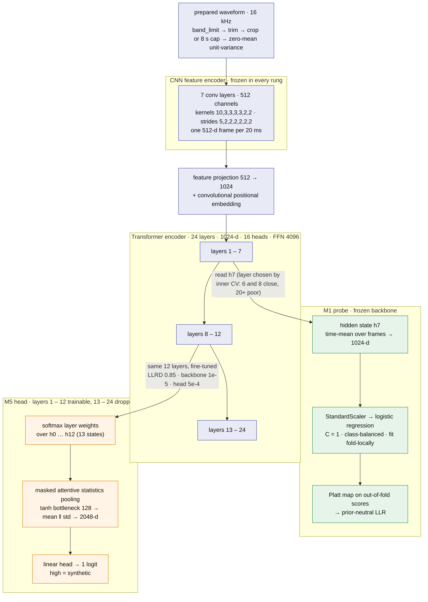
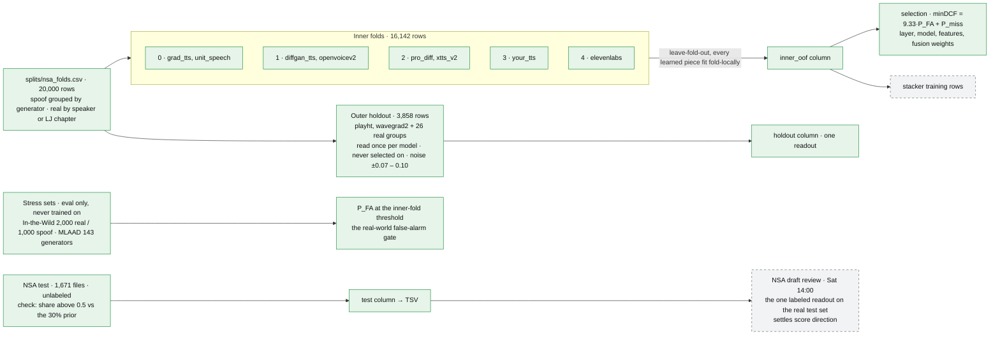
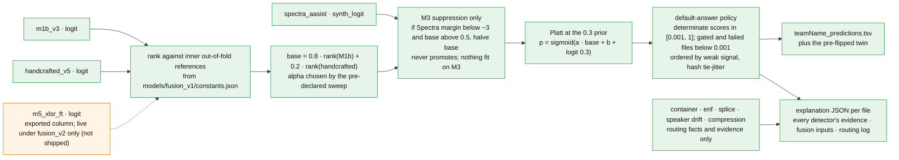

# HEARSAY architecture

Living document. Status as of **Sat Sep 26, 2026, ~04:40**. Where this file and `docs/plan.md` disagree on scope, the plan wins; on numbers, `submissions/log.csv` and the `models/*/meta.json` files win. Each component says whether it is **built**, **in flight** or **planned**, and which lane owns it (lanes are the parallel chats listed in `docs/handoffs/`). Diagrams are Mermaid and render on GitHub.

Legend for every diagram: green = built, amber = in flight, dashed grey = planned, blue = frozen pretrained weights.

## 1. What shapes the design

| Constraint | Source | Architectural consequence |
|---|---|---|
| 60% of the grade is normalized minDCF on 1,671 unlabeled test files; a false alarm costs 4× a miss; about 70% of files are real | NSA instructions | Every learned piece is selected on `9.33·P_FA + P_miss`; the real-speech side gets the most attention; ranking is all that matters, calibration is cosmetic |
| 20% for distinct techniques "actually leveraged", plus a bonus for choosing analyses per file | NSA brief rubric | One detector per rubric technique behind one contract; a rule-based orchestrator with a routing log |
| 20% for documentation in our own words, including what did not work | NSA brief | Every rung leaves a report; failed ideas are recorded, not deleted |
| Output is `filename<TAB>cm-score`, 1.0 = synthetic, one row per test file in template order | NSA instructions | A validating writer that never overwrites and always logs; a constant rollback TSV exists from hour one |
| Inference must run offline on CPU in a Docker image | NSA instructions | No hosted API or LLM on the scoring path; LightGBM is never imported at inference; one heavy model in memory at a time |
| The sponsor's shipped scoring code treats a higher score as bona fide, the opposite of the instructions | `data/nsa/HackGTMinDCF` | Both readings are logged for every model; direction is decided once (1.0 = synthetic, never flipped) and checked at the draft review |

## 2. System flow

_Rendered from [img/architecture-flow.mmd](img/architecture-flow.mmd); edit that file and re-render if the flow changes._

Since 08:35 the runner (`scripts/run_pipeline.py`) is the whole path: audio → every detector → the frozen fusion rule from `models/fusion_v1/constants.json` → the non-speech policy → TSV plus one explanation JSON per file with a routing log. M5 is not part of the shipped rule; its exported column exists for the stacker, and since 8316e50 the runner can also score it live, loaded only when the constants file weights it (`models/fusion_v2/constants.json`, the unshipped A3 w0.2 + E candidate). The rollback path is `--detectors m1b`, the M1b probe alone through its own Platt map.

## 3. Components

| Component | Where | Status | Lane |
|---|---|---|---|
| Loader, probe, silence trim, windows | `src/hearsay/audio.py` | built | main |
| Detector contract, `safe_run`, registry | `src/hearsay/detectors/base.py` | built | main (changes need every detector owner) |
| Metric (minDCF, EER, both sponsor-code readings) | `src/hearsay/metrics.py` | built | main |
| Fold file | `splits/nsa_folds.csv` (`scripts/make_folds.py`); training-only extension `splits/nsa_folds_plus_asv19.csv` (`scripts/extend_folds.py`) | built, frozen | main |
| Segment preparation for deep detectors | `src/hearsay/embed.py` (`prepare_segment`, `normalize_windows`, `test_duration_sampler`) | built | main |
| M1 embeddings + probe + TSV | `scripts/extract_embeddings.py`, `train_probe.py`, `make_probe_csv.py`, `src/hearsay/probe.py` | built | main |
| M3 Spectra-AASIST stream | `src/hearsay/spectra.py`, `scripts/spectra_direction.py`; `scripts/score_spectra.py` to come | in flight | M3 |
| M5 fine-tune (bundle, model, trainer, scorer, assembler) | `src/hearsay/m5_{bundle,data,model}.py`, `scripts/m5_*.py`, `scripts/cloud/` to come | in flight | M5 (vast.ai only) |
| Handcrafted features + v4 families + trainer + export | `src/hearsay/handcrafted.py`, `src/hearsay/hc_v4.py`, `scripts/extract_handcrafted.py`, `scripts/train_handcrafted.py` | built (v3); v4 families landing | CPU / teammate |
| Compression features + laundering | `src/hearsay/compression.py`, `scripts/extract_compression.py` | built | CPU |
| Rule-based detectors + exporter | `src/hearsay/detectors/{container,enf,splice,speech_gate,speaker_drift}.py`, `scripts/score_detector.py` | built | CPU |
| Learned-detector wrapper, numpy trees | `src/hearsay/detectors/_learned.py`, `src/hearsay/trees.py` | built | CPU |
| Fusion | `scripts/fuse.py`, `scripts/fuse_sweep.py` → `models/fusion_v1/constants.json` (rank references, α = 0.2, M3 false-alarm suppression, Platt at the 0.3 prior); `fusion_v0` retained for zmean / stack_nonlj; `scripts/fuse_sweep_m5.py --write` → `models/fusion_v2/constants.json` (A3 w0.2 + E: weights 0.6 / 0.2 / 0.2 over M1b v3, handcrafted v5, M5 in rank space, the same M3 step and Platt, M5 checkpoint hashes), runnable but not shipped | rule frozen by pre-declared sweep at 08:13 (`docs/reports/2026-09-26_fusion-sweep-predeclared.md`); fusion_v2 candidate qualifies (M5 addendum), held pending the draft review; final freeze Sat 22:00 | main |
| End-to-end runner, per-file explanation JSON, API | `src/hearsay/pipeline.py`, `scripts/run_pipeline.py`, `src/hearsay/api.py` | built (routing log from detector features; orchestrator v1 is static rules) | oversight chat's agent |
| Docker image | `Dockerfile`, `.dockerignore`, `docker/{build.sh,entrypoint.sh,assets.py}`, `tests/test_docker_image.py` | built and verified 07:56 (`hearsay:20260926-0753`, source 0963ed8): amd64, 2.66 GB compressed, offline-enforced, in-image 50-file parity max diff 1.4e-4, sha manifest of 70 shipped files checked at start | Docker chat |
| Submission writer + log | `src/hearsay/submission.py` | built | main |

## 4. Invariants (the rules the code enforces)

1. **One audio path.** Everything decodes through `load_audio`: FFmpeg, first audio stream, downmix, 16 kHz, float32, non-finite samples zeroed. Nothing downstream resamples or denoises. This also erases the container shortcut (training real speech is FLAC/22 kHz WAV, training fakes include MP3, every test file is 16 kHz PCM WAV).
2. **Same preparation for train and test, per detector.** Deep detectors: `prepare_segment` = `band_limit` (same filter) → silence trim (35 dB relative) → random crop to a test-duration length for training rows only → 8 s cap → per-input zero-mean/unit-variance. Engineered detectors: `hearsay.handcrafted._crop` = `band_limit` (Kaiser low-pass matching the test set's 7.2 kHz roll-off) → `prepare_segment` → RMS-normalize. Test clips are never cropped or tiled. The deep path gained `band_limit` inside `prepare_segment` on Sat Sep 26, ~04:20; `handcrafted._crop` passes `band_match=False` to it because it filters first.
3. **Score direction.** Every detector's score increases with synthetic likelihood; `DetectorResult` rejects anything else; `spectra_direction.py` asserts it on labeled data for M3; `train_handcrafted.py` defines the label so the export cannot invert.
4. **Never lose a row.** `safe_run` turns a crashing detector into `status="error"`, score 0.5, which fusion treats as missing, never as evidence. `score_files` gives a decode failure the fallback score plus a flag. `write_submission` refuses duplicates, non-finite values, out-of-range scores and existing paths.
5. **Fold discipline.** Spoof grouped by generator, real by speaker (LJ by chapter). Outer holdout = `playht` + `wavegrad2` + 26 real groups (3,858 rows), never trained on, never used for selection, read once per model. Inner folds 0–4 (16,142 rows) give out-of-fold scores; every learned piece, including scalers, Platt maps and the stacker, is fit fold-locally. Extra training data (ASVspoof 2019 real speech for M1b, the M5 extra pool) enters inner folds only, so holdout numbers stay comparable across models.
6. **One export format.** `outputs/detector_scores/<name>.csv` with `path, fold, split ∈ {inner_oof, holdout, test}, score, logit`, 21,671 rows, unique paths. Fusion is trained on the `inner_oof` rows, read out on `holdout`, applied to `test`.
7. **No LightGBM at inference.** It and torch each bundle an OpenMP runtime and crash together on macOS. Bundles store the dumped trees; `hearsay.trees` evaluates them in numpy and gives per-feature contributions for the evidence sentence.
8. **Offline.** Weights are local (`weights/`), `HF_HUB_OFFLINE=1`; no LLM or hosted service is on the scoring path.
9. **Every TSV is logged** with its outer-holdout minDCF and EER; a submitted TSV is never overwritten.

## 5. The detector contract

`ClipContext` → `DetectorResult(name, score ∈ [0, 1], evidence: str, features: {str: float}, status ∈ {ok, skipped, error})`. Detectors load heavy models lazily inside `run`, share expensive intermediates through `ctx.memo`, and never read filenames or filesystem timestamps. Fusion input per detector: the exported `logit` column from `outputs/detector_scores/<name>.csv`, standardized on inner rows, when `ok`. That column holds the raw decision value (e.g. Spectra-AASIST's synth_logit, whose margins run ±10–17), so nothing saturates. For live `DetectorResult`s without an export it falls back to `logit(clip(score, 1e-4, 1 − 1e-4))`. When a detector isn't `ok`, the value is imputed with the fold-local train mean plus a `<name>.missing` indicator. The registry iterates in sorted name order so fusion columns are stable.

## 6. Deep detectors

### 6.1 Depth at a glance

| Rung | Backbone | Depth used | Width · heads | Trainable | Head | Output |
|---|---|---|---|---|---|---|
| M1 | XLS-R 300M (`facebook/wav2vec2-xls-r-300m`) | all 24 transformer layers run; layer 7 hidden state is read | 1024-d · 16 heads · FFN 4096 | nothing (probe only: 1,024 weights + bias) | time-mean → StandardScaler → logistic regression (C = 1, class-balanced) → Platt map | prior-neutral LLR, then posterior at π = 0.3 |
| M5 | XLS-R 300M, truncated | layers 1–12 kept, 13–24 discarded (≈ 151 M of the ≈ 302 M transformer params) | 1024-d · 16 heads | all 12 kept layers (layer-wise LR decay 0.85, backbone 1e-5, head 5e-4); CNN encoder frozen | softmax-weighted sum over hidden states h0…h12 → masked attentive statistics pooling (tanh bottleneck 128; mean ‖ std → 2048-d) → linear | one logit, high = synthetic |
| M3 | Spectra-AASIST (`lab260/Spectra-AASIST`), its own XLS-R copy | full 24-layer XLS-R inside the checkpoint | 1024-d · 16 heads | nothing (scoring only) | MLP bridge → residual conv encoder → spectral + temporal graph attention → 4 heterogeneous stacked-graph branches (64 → 32) → linear | 2 logits (spoof, bonafide); synth_logit = spoof − bonafide, window-averaged |

The CNN feature encoder is the same in all three: 7 convolution layers of 512 channels, kernels 10,3,3,3,3,2,2 with strides 5,2,2,2,2,2,2, so one 512-d frame every 20 ms (320× downsampling). Each transformer layer is about 12.6 M parameters.

### 6.2 XLS-R backbone with the M1 probe and the M5 head

**M1, frozen XLS-R 300M + logistic probe (built).** Segment-mode embeddings: per-layer time-mean of the whole prepared clip, all 25 hidden states kept (`(N, 25, 1024)` shards under `outputs/embeddings/`). Layer chosen by inner-fold CV (layer 7 wins; 6 and 8 close, 20+ poor). Standardized class-balanced logistic regression, Platt-mapped to a prior-neutral LLR on out-of-fold scores. Current: holdout minDCF 0.146, EER 2.5% (v2; the band-matched v3 re-extraction is running). **M1b** adds 5,128 ASVspoof 2019 real clips (40 speakers) plus 2,520 spoof anchors to the inner folds: holdout 0.079, but In-the-Wild stress slightly worse (0.405 vs 0.374) and P_FA at the inner threshold up from 1.2% to 5.7%. Both sit at 0.37–0.40 on In-the-Wild against 0.08–0.15 on the NSA-domain holdout; that gap, not the fusion choice, is the headline risk.

**M5, fine-tuned XLS-R (in flight, vast.ai A100s).** Backbone truncated to 12 transformer layers, CNN encoder frozen, learned softmax-weighted layer sum → attentive statistics pooling → linear logit (`src/hearsay/m5_model.py`). Trained on the NSA sample plus a training-only extra pool (rest of DiffSSD capped per generator, ASVspoof 2019 real + a spoof channel anchor, gated MLAAD), with class-blind augmentation (noise, band-limits, reverb, codec round-trips, RawBoost convolutive, trim jitter), label smoothing 0.05, cosine schedule with 8% warmup, bf16. Protocol: pilot → NSA-only vs NSA+extra ablation on inner folds → 5 fold models (out-of-fold scores for stacking) + 1 full model (holdout and test). Gate: beat M1 on inner OOF and holdout by Sat 12:00, and not worse than M1 on In-the-Wild false alarms, or M1 stays. Ships one checkpoint (truncated backbone + head as safetensors, sha-pinned) that must run on CPU with Spearman > 0.99 against the box's bf16 scores.

### 6.3 Spectra-AASIST (M3)

```mermaid
flowchart LR
  W3["window · 64,600 samples ≈ 4.04 s<br/>pre-emphasis · from the prepared clip"]
  X3["XLS-R 300M · 24 layers · 1024-d · 16 heads<br/>Spectra's own fine-tuned copy"]
  B3["MLP bridge<br/>1024-d frames → AASIST input"]
  E3["residual conv encoder<br/>filters 32 → 32 → 64 → 64"]
  G3["spectral GAT + temporal GAT · dim 64<br/>graph pooling ratio 0.5"]
  H3["4 heterogeneous stacked-graph attention branches<br/>64 → 32 · max + mean readout"]
  O3["linear 160 → 2<br/>logits (spoof, bonafide)"]
  S3["synth_logit = spoof − bonafide<br/>averaged over windows · exported as the logit column"]
  W3 --> X3 --> B3 --> E3 --> G3 --> H3 --> O3 --> S3
  classDef frozen fill:#e8eaf6,stroke:#3949ab,color:#111
  classDef flight fill:#fff4e5,stroke:#e37400,color:#111
  class X3,B3,E3,G3,H3,O3 frozen
  class W3,S3 flight
```

**M3, Spectra-AASIST (in flight).** Off-the-shelf detector wrapping its own XLS-R; logits `(spoof, bonafide)`, `synth_logit = logit_spoof − logit_bonafide`. No training. Every row (inner, holdout, In-the-Wild, test) goes through `prepare_segment` with the shared test-length crops for training rows, then 64,600-sample windows; short-clip handling (zero-pad by default) is chosen by a pilot on inner rows. Value: a second deep score stream trained on different data, for the stacker. Its In-the-Wild readout is flagged "possibly optimistic" because the checkpoint's training data is undisclosed. Cost is comparable to M1 extraction, so it shares the MPS GPU with the main chat in turns.

## 7. Engineered detectors

```mermaid
flowchart LR
  A["load_audio<br/>16 kHz mono"] --> B["band_limit<br/>Kaiser 71 taps · 7.25 kHz · 45 dB"] --> T["trim_silence<br/>35 dB relative"] --> D["train: random crop to a test-duration length<br/>test: whole clip, 8 s cap"] --> N["RMS-normalize to 0.1"]
  N --> S["STFT · n_fft 512 · hop 160<br/>32 ms frames every 10 ms"]
  N --> Y["YIN pitch · 60 – 400 Hz<br/>voiced mask"]
  S --> F75["75 handcrafted features<br/>64 spectral · 11 prosody"]
  Y --> F75
  S --> V4["v4 families, opt-in via --families<br/>lfcc 60 · phase 12 · cqcc · modulation · breath"]
  F75 --> TR["training only: LightGBM vs logistic<br/>300 trees · 31 leaves · min_child 40<br/>winner chosen by inner out-of-fold minDCF"]
  V4 --> TR
  TR --> DU["bundle: dumped trees + feature stats<br/>models/hc_lgbm_stamp/model.joblib"]
  DU --> NP["hearsay.trees · numpy evaluator<br/>P(synthetic) + per-feature path contributions"]
  NP --> EV["evidence sentence<br/>top-3 features in SD from real speech"]
  NP --> EX["outputs/detector_scores/handcrafted.csv<br/>path · fold · split · score · logit"]
  classDef built fill:#e6f4ea,stroke:#1e8e3e,color:#111
  classDef flight fill:#fff4e5,stroke:#e37400,color:#111
  class A,B,T,D,N,S,Y,F75,TR,DU,NP,EV,EX built
  class V4 flight
```

**Handcrafted spectral + prosody (built, v3; v4 families landing).** 75 features on the band-matched, trimmed, test-length-cropped, RMS-normalized clip: high-band energy ratios, roll-offs, centroid, bandwidth, flatness, 6-band spectral contrast, flux, 20 MFCC means + stds; YIN pitch statistics, energy dynamics, pauses, zero-crossing rate. Logistic vs LightGBM chosen by inner OOF; LightGBM wins since band matching. Holdout minDCF 0.254, EER 4.3%; blind to `grad_tts`, `pro_diff` (1.00) and `elevenlabs` (0.80); weak on LibriSpeech real (0.77 inner). `src/hearsay/hc_v4.py` (commits `4b644c9`..`22b1ac3`) adds six opt-in families over the same context, all implemented and gated per `docs/handoffs/2026-09-26_handcrafted-v4-brief.md`: LFCC (40 linear filters to 7 kHz, 20 coefficients, mean/std/delta-std), phase (group-delay spread per voiced frame, peak phase-vs-magnitude coherence), CQCC (65 Hz–7 kHz, 24 coefficients), modulation spectrum of the loudness envelope, breath (between-speech frames) and cycle-level jitter/shimmer. Gate tables and the codec check are in `docs/reports/2026-09-26_handcrafted-v4.md`. v3 output is byte-identical with no families.

**Compression forensics (built).** 19 features in 3–7 kHz: spectral holes (deep and local), hole flicker and runs, floor depth, effective bandwidth, high-band tilt. Trained with laundering equalization (a random half of both classes re-encoded through MP3/AAC) so "lossy = ElevenLabs/PlayHT" cannot be learned. It detects codec history well (AUC 0.90–0.94) and the class barely (holdout 0.90). The test set reads as laundered throughout, so this is routing and evidence, not a fusion column, unless leave-one-out says otherwise.

**Non-speech gate and speaker drift (built ~06:10, rule-based; report `docs/reports/2026-09-26_gate-and-drift.md`).** `speech_gate` decides `is_speech` from five cues (not silent, voiced ≥ 5% of frames, log-F0 std ≥ 0.02, loudness std ≥ 3 dB, spectral flatness < 0.5), each threshold set beyond the extreme of the full NSA test set, so 0 of 1,671 test files are gated; its score stays 0.5 and fusion never sees it. `speech_gate.apply_default_answer` implements decision 4: a gated file gets `0.02 + 1e-4 × fused score`, so it ranks below every speech file in a deterministic order. Known limit: rhythmic polyphonic music can pass; the preflight and the > 0.8 flag remain the backstop. `speaker_drift` runs ECAPA (`speechbrain/spkrec-ecapa-voxceleb`, Apache-2.0, 89 MB in `weights/`) on 1 s windows at 0.5 s hop and flags min pairwise cosine < 0.05 (score 0.6, else 0.5): 94% of two-speaker splices flagged, 6% of single voices. Finding: fakes are the most self-consistent voices (mean-cosine class AUC 0.73 toward fake), so drift is evidence of editing or of a real speaker and the column must not be fused; routing and evidence only. Docker needs SpeechBrain and those weights.

**Container, ENF, splice (built, rule-based).** Container returns header facts and a constant 0.5 on this test set by design (the container is the label on the training data; every test file carries the same FFmpeg tag). ENF tracks 50/60 Hz hum stability (present in 24 test files; in 36% of LJ clips, so a learned version would learn "hum = real"). Splice flags clicks and DC jumps (58 test files). All three carry evidence and routing facts for the rubric; none moves minDCF.

## 8. Validation and selection

- **Selection metric:** normalized minDCF at π_synth = 0.3, C_FA = 4, on inner out-of-fold scores. EER and the sponsor-code readings are reported alongside, never selected on.
- **Holdout:** read once per model; two generators and 26 real groups, so its noise is about ±0.07–0.10 and a gap under 0.15 is not evidence.
- **Stress sets (eval only, never trained on):** In-the-Wild (2,000 real from 54 speakers, 1,000 spoof) for false alarms on unfamiliar real speech; MLAAD (143 generators) available as a miss-rate readout for models that did not train on it.
- **Test-set distribution check:** share of test files above 0.5 against the stated ~30% synthetic. Handcrafted went from 90% to 42% with band matching; M1 sat at 40% before its band match.
- **Preflight before every TSV:** silence and a synthetic chord through the scorer; finite, reproducible, and the scores are logged (M1 currently scores both near 1.0, which a non-speech gate must address).
- **The one labeled readout on the real test set** is NSA's draft review on Saturday afternoon. It settles the score-direction question and compares at most two candidates.

## 9. Fusion and outputs (M4, rule frozen 08:13)

## 10. Open architecture decisions

1. **Band matching in the deep path: resolved.** `prepare_segment` applies `band_limit` first since commit `133e536` (Sat ~04:20). M1's v3 embeddings are being re-extracted; M3 inherits it through `prepare_segment`; M5 filters once in the bundle build and passes `band_match=False` on the box. The v2 embeddings and every number quoted from them predate the fix.
2. **Fusion rule.** Inner OOF says M1 alone (0.250) beats the M1 + handcrafted mean (0.258); the holdout says the mean is far better (0.066 vs 0.146); the logistic stacker zeroes the handcrafted column. Both gaps are inside holdout noise. Candidates: constrained stacker (non-negative weights, shrink toward equal), rank averaging, nested CV of the fusion rule. LJ is one speaker on both sides of every fold, so the stacker should be fit on LibriSpeech and ASVspoof out-of-fold real rows, or treat LJ as weakly grouped. Awaiting the fusion consult's answer (`docs/consults/2026-09-26_fusion-strategy_CONSULTATION.md`, updated with the In-the-Wild table and the band-wall finding).
3. **Which columns fuse.** M1 (or M5), handcrafted, M3 if it lands: yes. Compression: only if leave-one-out shows a gain. Container, ENF, splice: evidence and routing only. M5 exports `stackable:false` if any fold model is missing; fusion must handle a test/holdout-only column.
4. **Default answer for undetermined files.** Decode failures, non-speech (silence, music), detector disagreement: with a false alarm at 9.33× a miss, uncertain files belong at the real end of the ranking, deliberately tie-broken. A voiced-fraction gate is the first candidate (test median voiced fraction 0.8). Depends on the sponsor's scoring direction; the draft review is the tripwire.
5. **Orchestrator scope.** Routing facts already exist as detector features: container `lossy`/`is_pcm_wav`/`ffmpeg_written`, compression `bw_hz` (69 test files lack the 7.2 kHz wall; a few are telephony-band), ENF presence, splice seams, voiced fraction. v1 is static rules over these plus a per-file routing log in the explanation report. Escalation (run the expensive deep model only where cheap detectors disagree) is possible but unnecessary at 1,671 files; see 6.
6. **Test-time compute.** The test set is about 95 minutes of audio, so inference cost is not a constraint; validation is. Options ranked by expected value: average M5's five fold models with the full model at test time (free once trained, reduces variance, which is what drives false alarms); average M1 probes on layers 6–8 (embeddings exist; validate on inner folds); a second backbone (WavLM Large weights are downloaded, never run); multi-crop averaging only for the few test clips over 8 s (75% are under 3.8 s). Anything adopted must be validated on inner folds and must keep the test-set share above 0.5 near 30%.
7. **Docker: resolved.** Image built and verified at 07:40 (see section 3). Encoder truncation to layer 8 is on in the runner, bit-identical and pinned by a test. Remaining: the Sunday rebuild after the fusion freeze, and M5's checkpoint if M5 clears its gate.

## 11. Shortcut ledger

Every train-vs-test difference found so far, and where it is closed. Any new detector or dataset is checked against this list.

| Shortcut | Evidence | Closed by |
|---|---|---|
| Peak level | test peaks near 1.0, training real ~0.5; AUC 0.66 alone | per-input z-normalization (deep), RMS normalization (engineered); level is never a feature |
| Leading silence | LibriSpeech 0.37 s vs test 0.06 s | `trim_silence` on train and test |
| Duration and tiling | training 5–9 s vs test ~3.4 s; repeat-padding put a seam only in test data | segment mode: no tiling, training crops drawn from the test-duration distribution; M3 scores training rows with the same crops |
| Container / codec | real = FLAC or 22 kHz WAV, fakes include MP3, test = 16 kHz PCM with one FFmpeg tag (also on PlayHT) | `load_audio` for everything; container detector never learned; laundering-equalized compression training |
| 7.2 kHz low-pass on the test set | 1,602 of 1,671 test files drop 44 dB between 6.5 and 7.5 kHz; no training corpus does | `band_limit` in both paths (`prepare_segment` since Sat ~04:20); v2 deep embeddings predate it and are being re-extracted |
| Mains hum | stable hum in 36% of LJ, 21% of LibriSpeech, <0.5% of nine generators | ENF never learned; low-frequency features checked LJ-vs-LibriSpeech |
| Crop edges | training crops start mid-word, test clips are whole utterances | no onset/offset features |
| LJ single speaker | one voice on both sides of every fold | folds group LJ by chapter; stacker to be fit on non-LJ real rows |
| Double low-pass stopband (found Sat 13:00, channel-robustness rung) | test files already carry their own ~7.2 kHz wall, so after the pipeline's `band_limit` their 7–8 kHz stopband is far deeper than any training clip's (whole-spectrogram 1st percentile −157 dB vs −138 dB for holdout real; −118 dB as delivered). Band matching removes the >7 kHz *energy* difference but not the *depth* of the stopband, because the test files are filtered twice | **open, unmeasured for the detectors.** Training rows pass one filter, test rows two, so the stopband depth differs between train and test for every detector. Whether M1b, M3 or handcrafted respond to it is not measured. Features that read the whole spectrum (percentiles, floors) must be computed below 7 kHz; this cue drove the withdrawn λ̂ = 0.947 (`docs/reports/2026-09-26_channel-robustness.md`, A). An untested remedy: one more `band_limit` pass on training rows|
| Non-speech | silence and a chord score ~1.0 with M1 | `speech_gate` + `apply_default_answer` (decision 4); 0 of 1,671 test files gated |
